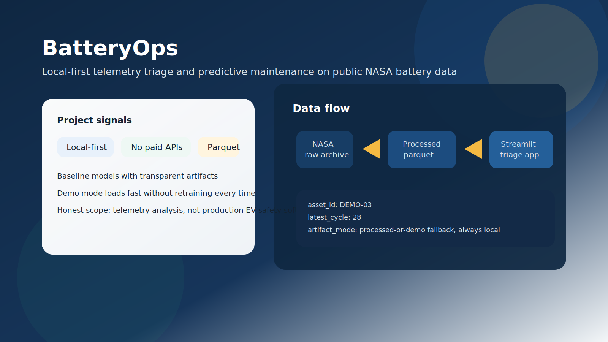
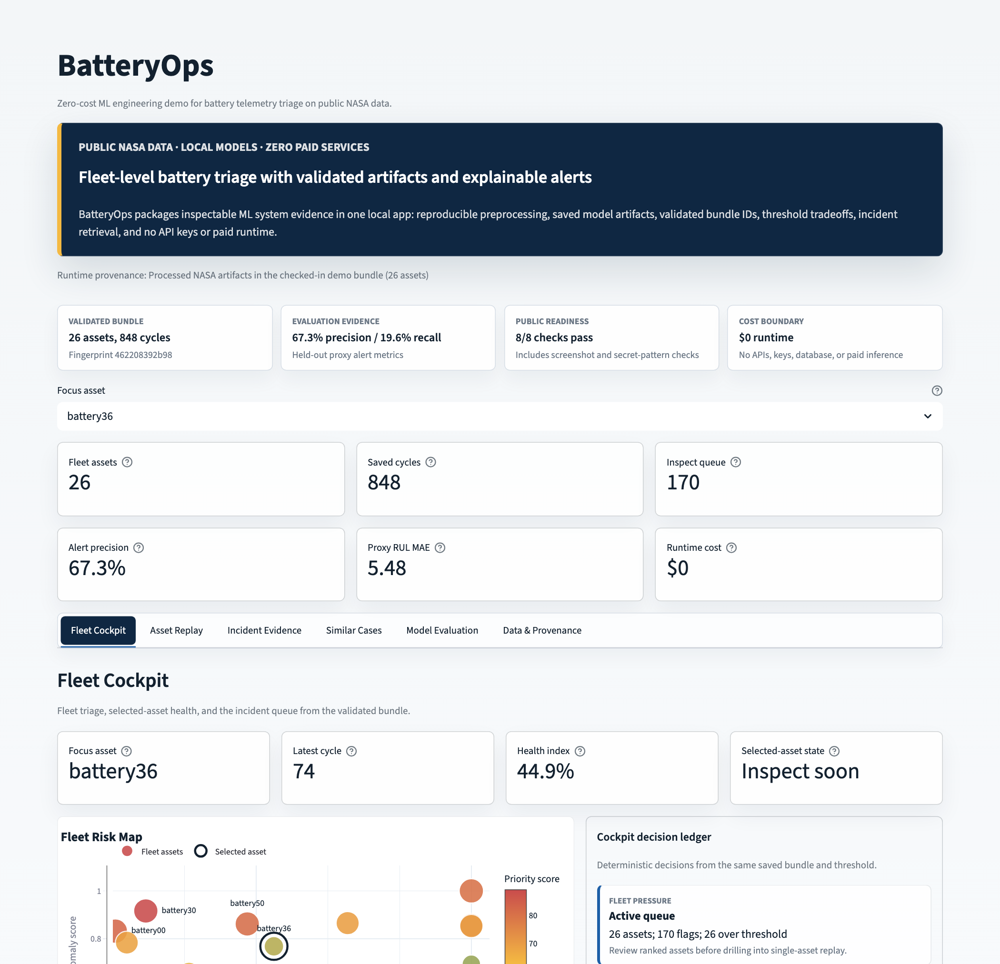
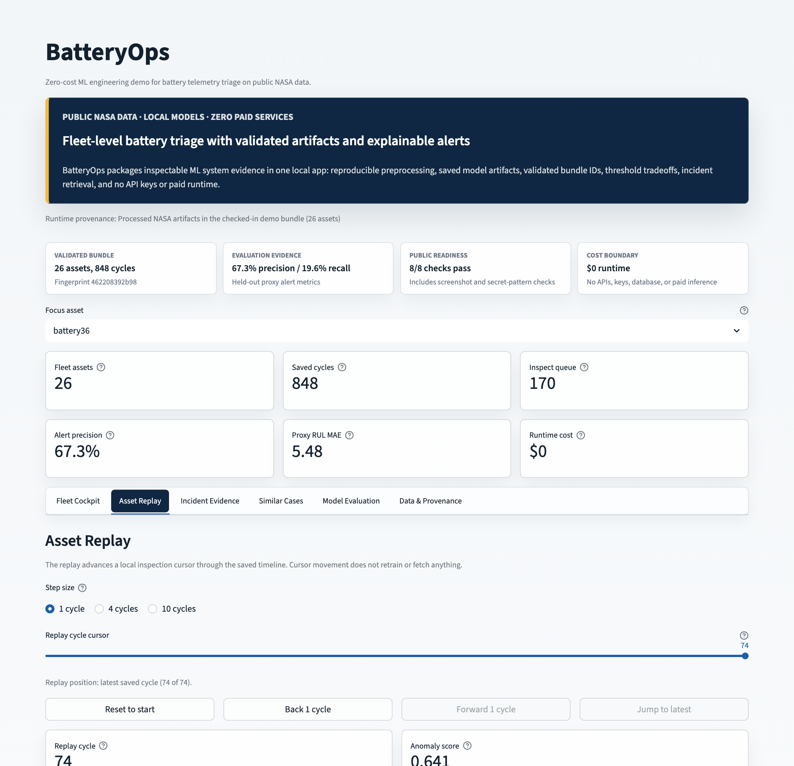
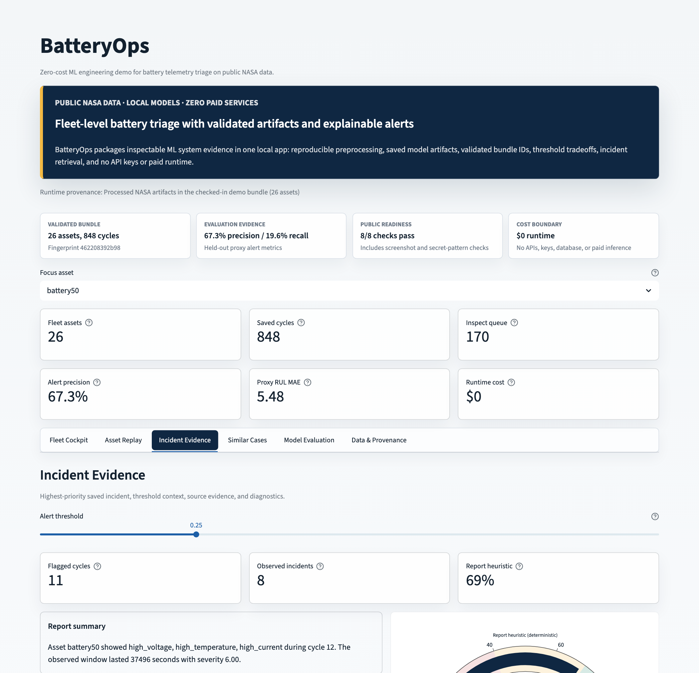
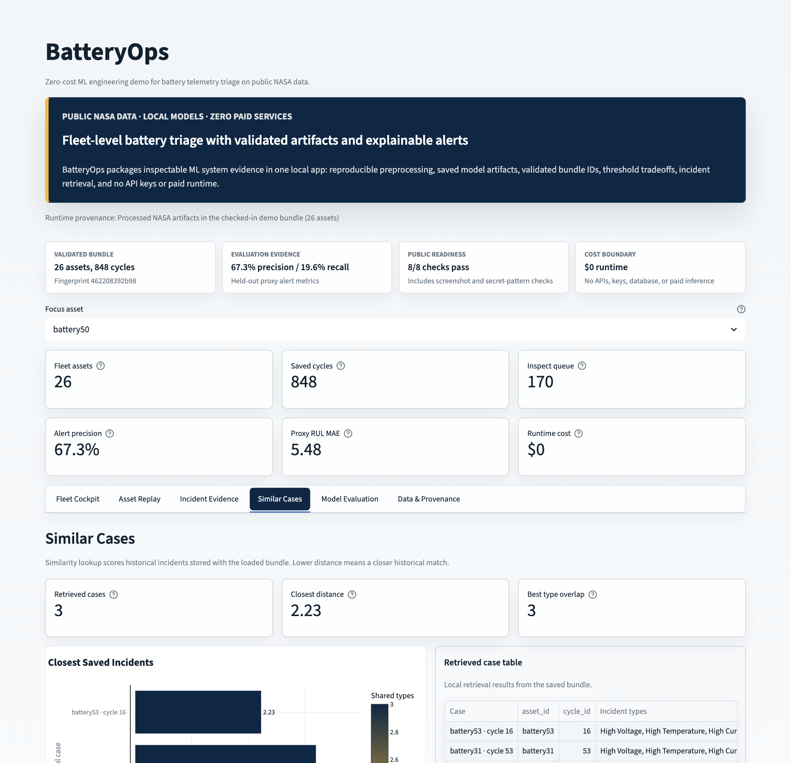
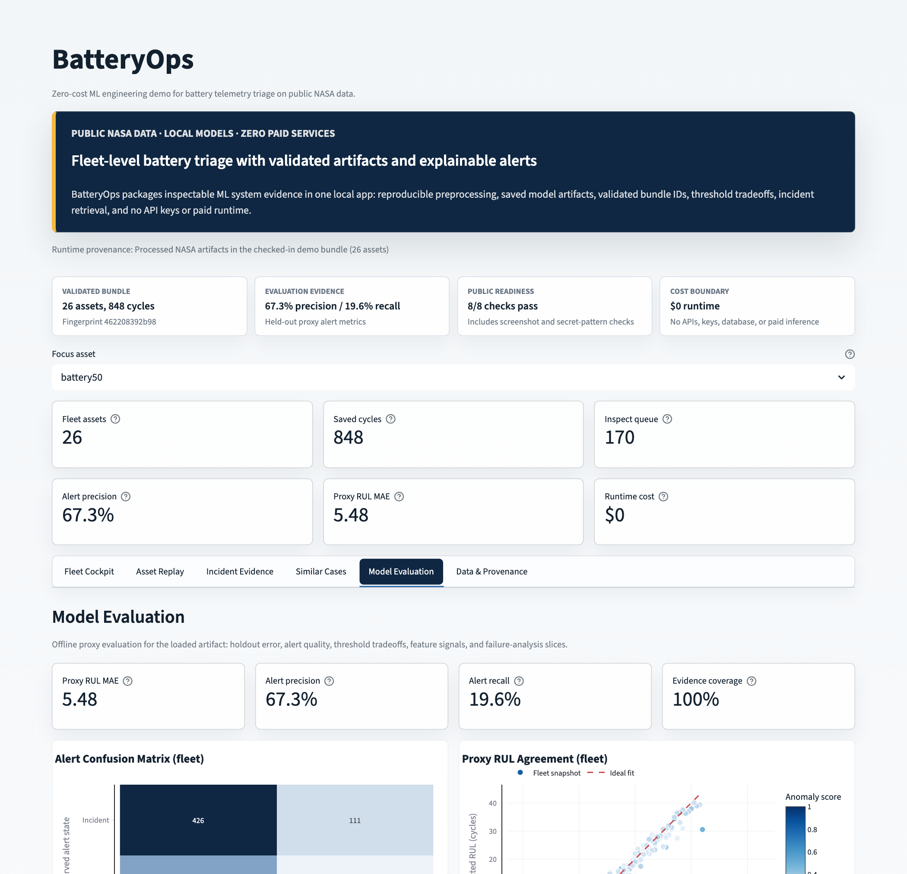
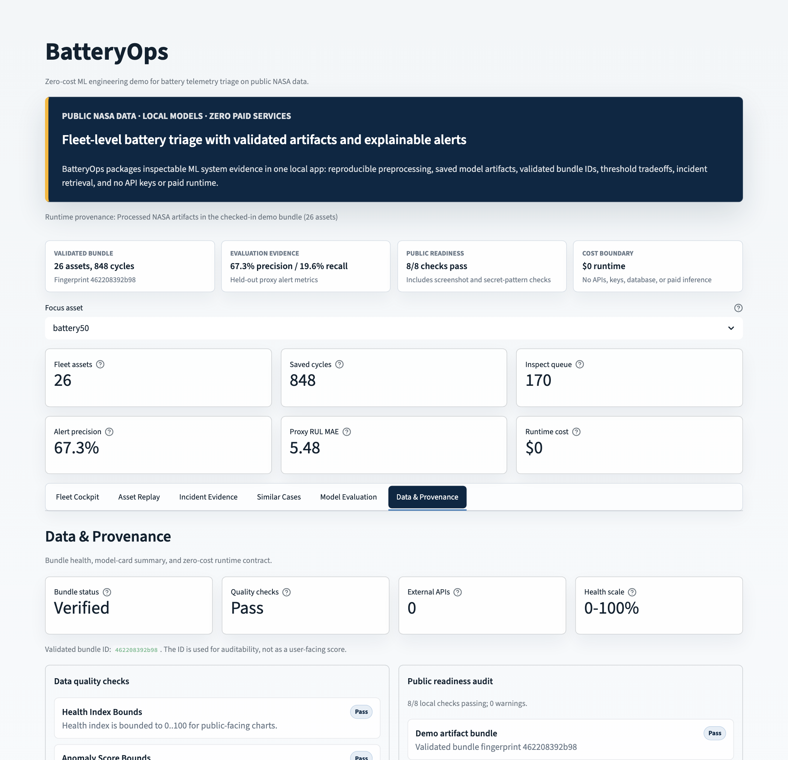
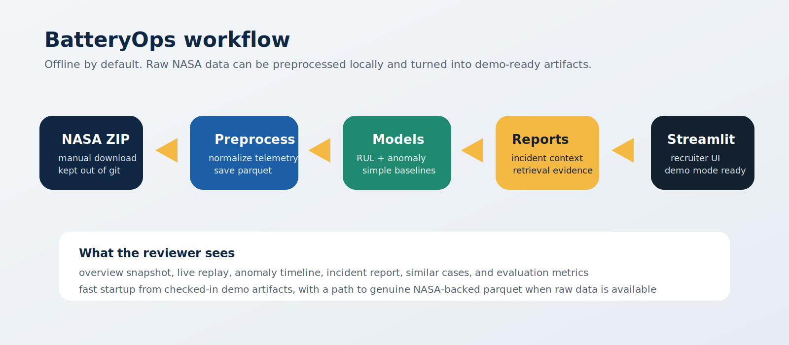

# BatteryOps

[](https://github.com/mherrera-ai/BatteryOps/actions/workflows/ci.yml)
[](LICENSE)
[](pyproject.toml)
[](#zero-cost-contract)

BatteryOps is a zero-cost ML engineering portfolio project for battery telemetry triage. It turns public NASA battery data into a validated local artifact bundle, then serves a Streamlit cockpit with fleet risk, asset replay, incident evidence, nearest-neighbor case retrieval, model evaluation, and provenance.

The public demo uses only Python, Streamlit, scikit-learn, pandas, Plotly, and checked-in artifacts. There are no paid APIs, API keys, hosted databases, auth providers, or metered services.



## 5-Minute Review

1. Launch the app with `batteryops-demo` or deploy the free Streamlit Community Cloud entrypoint at `app/streamlit_app.py`.
1. Review the first-screen proof strip and Fleet Cockpit `Triage handoff` table for the fastest product walkthrough.
1. Open `docs/recruiter-review.md` for the fastest walkthrough of what the project proves.
1. Open `docs/model-card.md` and `docs/data-card.md` for the ML framing and data-quality story.
1. Inspect `artifacts/demo/training_manifest.json` for artifact hashes, bundle fingerprinting, and schema `3`.
1. Run `batteryops-audit` for a local public-readiness audit of artifacts, docs, screenshots, and the zero-cost contract.
1. Run `make check` for linting, typing, tests, the public audit, and artifact validation.
1. Run `make deploy-check` to verify the Streamlit Cloud dependency path with no secrets or paid services.

## Start Here

- [Demo](#demo)
- [Why It Stands Out](#why-it-stands-out)
- [Quick Start](#quick-start)
- [Portfolio Review Guide](#portfolio-review-guide)
- [Dashboard Flow](#dashboard-flow)
- [Public Readiness Audit](#public-readiness-audit)
- [Screenshots](#screenshots)
- [Current Demo Bundle Metrics](#current-demo-bundle-metrics)
- [Architecture](#architecture)
- [Zero-Cost Contract](#zero-cost-contract)
- [Verification](#verification)
- [Data Prep](#data-prep)
- [Limitations](#limitations)
- [Publishing Notes](#publishing-notes)

## Demo

The project is complete as a public repo and can be reviewed from the screenshots, checked-in artifacts, docs, tests, and local Streamlit app.

Run the cockpit locally:

```bash
batteryops-demo
```

Optional free Streamlit Community Cloud deployment settings:

- Repository: `mherrera-ai/BatteryOps`
- Branch: `main`
- Main file path: `app/streamlit_app.py`
- Dependencies: `requirements.txt`

The local path remains the source of truth if a free hosting policy ever changes.

## Why It Stands Out

- **ML engineering, not a mock UI:** preprocessing, feature extraction, model training, retrieval, reporting, evaluation, and dashboard code live under `src/batteryops`.
- **Fleet-level product thinking:** the cockpit starts with a risk map, priority queue, decision ledger, risk concentration, replay, incident evidence, and provenance instead of isolated charts.
- **Reviewable artifacts:** the checked-in bundle has model files, parquet outputs, metrics, a report, model card, data-quality report, evaluation report, and SHA-256 fingerprinting.
- **Auditable public-readiness:** `batteryops-audit` validates the checked-in bundle, docs, screenshots, free deploy path, community files, and dependency cost guard.
- **Responsible claims:** RUL and alerts are clearly framed as proxy demo metrics, not safety certification.
- **Zero-cost runtime:** the app runs without API keys, hosted databases, paid inference, or cloud services.
- **Recruiter-friendly UX:** the dashboard opens directly to the fleet cockpit instead of a landing page.

## Quick Start

From a fresh checkout:

```bash
python3 -m venv .venv
source .venv/bin/activate
python3 -m pip install --upgrade pip
python3 -m pip install -e ".[dev]"
make check
batteryops-demo
```

`batteryops-demo` is the saved-bundle launch path documented here; `batteryops` is the shorter alias.

Run `batteryops-demo` from the repository root, or from another workspace that contains local `artifacts/demo/`. Local `data/processed/` parquet is optional and only used for preprocessing or retraining workflows that regenerate the demo bundle.

## Portfolio Review Guide

For a fast reviewer path, start with [docs/recruiter-review.md](docs/recruiter-review.md). It maps the repo to the engineering signals this project is meant to demonstrate: local ML artifacts, evaluation discipline, product-quality dashboarding, reproducible checks, and a hard zero-cost boundary.

## Dashboard Flow

1. `Fleet Cockpit`: fleet risk map, ranked priority queue, cockpit decision ledger, risk concentration, selected-asset risk drivers, health trend, RUL proxy, and current triage note
1. `Asset Replay`: cycle cursor, anomaly score, proxy RUL, and replay chart
1. `Incident Evidence`: threshold context, source evidence, diagnostics, and downloadable incident brief
1. `Similar Cases`: nearest-neighbor incident retrieval over saved historical cases
1. `Model Evaluation`: confusion matrix, RUL scatter, threshold tradeoff, feature signals, per-asset error, and alert coverage
1. `Data & Provenance`: data-quality checks, artifact inventory, model-card summary, limitations, and zero-cost contract

## Public Readiness Audit

Run the local audit before publishing:

```bash
batteryops-audit
```

The audit checks the validated artifact bundle, zero-cost flags, Streamlit Community Cloud path, reviewer docs, screenshot gallery, secret-like token patterns, community files, and dependency manifests. It also supports JSON for CI or review automation:

```bash
batteryops-audit --json
```

## Screenshots








Refresh the gallery with:

```bash
npm ci
make screenshots
```

## Current Demo Bundle Metrics

Metrics below are from the checked-in bundle and are used as portfolio evidence only.

| Metric | Value |
| --- | ---: |
| Data source | `processed` |
| Evaluation mode | `leave-one-asset-out degradation proxy` |
| Assets in artifact bundle | `26` |
| Cycle count | `848` |
| Incident case count | `537` |
| Alert lead time | `0.4615` cycles |
| Alert precision | `67.31%` |
| Alert recall | `19.55%` |
| False positive rate | `16.4%` |
| RUL proxy MAE | `5.483` cycles |
| Evidence source coverage | `100%` |
| Health index range | `0.0-100.0%` |

The current `26`-asset, `848`-cycle, `537`-incident bundle is validated before the app uses it. When bundle metrics change, regenerate artifacts, refresh screenshots, and update this table together.

## Architecture



Current flow:

1. Manually place a supported public NASA archive into `data/raw/`.
1. Run preprocessing into local parquet under `data/processed/`.
1. Train local scikit-learn baselines and retrieval artifacts into `artifacts/demo/`.
1. Save metrics, model card, data-quality report, evaluation report, incident report, and manifest provenance.
1. Validate the saved bundle before the app consumes it.
1. Render the dashboard from the persisted bundle, or use deterministic fallback telemetry when no valid bundle exists.

Do not read `data/processed/` directly at app startup. The checked-in public demo does not need those local caches to launch; they are only inputs for rebuilding the saved bundle and are not a runtime dependency for the public demo path.

For module-level detail, see [docs/architecture.md](docs/architecture.md).

## Zero-Cost Contract

BatteryOps is designed to cost nothing:

- No external API calls
- No API keys or secrets
- No hosted database
- No paid model inference
- No auth provider
- No metered cloud service
- Free local run path through `batteryops-demo`
- Free public demo path through Streamlit Community Cloud

The repo includes tests that check the public artifact contract and deployment dependency path do not require paid services.

## Verification

```bash
make check
make deploy-check
```

`make check` runs linting, type checking, tests, the public-readiness audit, and artifact validation. `make deploy-check` creates a temporary install from `requirements.txt` and validates the checked-in bundle plus zero-cost artifact flags.

## Data Prep

Supported local source archives:

- `data/raw/nasa_rr_battery.zip`
- `data/raw/nasa_rw1_battery.zip`

Official sources:

- [Randomized and Recommissioned Battery Dataset](https://data.nasa.gov/dataset/randomized-and-recommissioned-battery-dataset/resource/cdea0a46-2c8d-4192-bbe7-8fbebfcfdb31)
- [Randomized Battery Usage 1: Random Walk](https://data.nasa.gov/dataset/randomized-battery-usage-1-random-walk/resource/ddffaa98-4c93-464f-aef1-b68eae64096f)

```bash
python3 -m batteryops.data.preprocess
python3 -m batteryops.models.train
```

Raw ZIPs and processed parquet stay local-only. The public repo ships the compact validated demo bundle instead.

## Limitations

- This is a portfolio-grade ML engineering demo, not production EV safety software.
- Capacity-like source values are normalized into `health_index_pct` for public charts because NASA source scales differ.
- RUL and alert metrics are proxy evidence for this artifact bundle, not calibrated deployment claims.
- The report confidence score is deterministic and narrative; it is not a probability.

## Publishing Notes

This repository is meant to be public. Keep source, tests, docs, screenshots, and the validated demo bundle checked in. Keep raw archives, processed parquet, virtual environments, `node_modules/`, logs, scratch files, and generated build outputs out of git.

For repo housekeeping, see [Contributing](CONTRIBUTING.md) and [Security](SECURITY.md).
